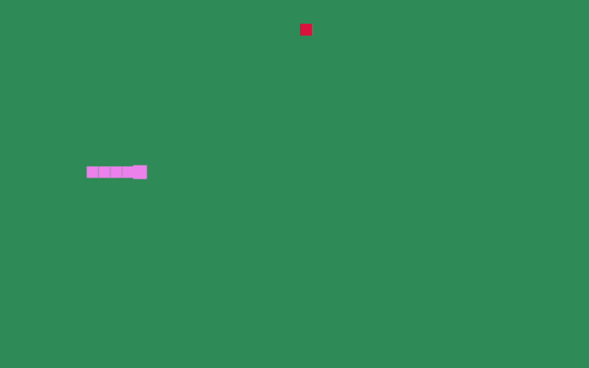

# Snake Bevy

## What is it ?

Very very minimal example of a snake game made with bevy.

## Keys 

- **Keboard arrows** : change direction ;
- **Escape** : quit ;

## Compile and run

Simply clone this repo and `cargo run`. Eventually modify the `cargo.toml` to set compilation settings.
